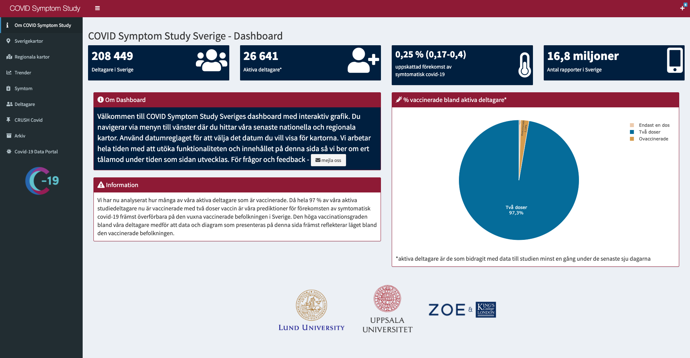

# COVID Symptom Study Sweden dashboard 


```{r, include = FALSE}
knitr::opts_chunk$set(
  collapse = TRUE,
  comment = "#>",
  fig.path = "man/figures/README-",
  out.width = "100%"
)
```


The dashboard is available [here](https://csss-resultat.shinyapps.io/csss_dashboard/)




## About COVID Symptom Study - Sweden

The COVID Symptom Study was a non-commercial project that used a free smartphone
app to facilitate real-time data collection of symptoms, exposures, and risk factors
related to COVID-19. The app was developed by researchers at King’s College and
Guys and St Thomas’ Hospitals in London in partnership with health science
company Zoe Global Ltd. Baseline data and recurring daily questions are described in
<a href = https://science.sciencemag.org/content/368/6497/1362> Drew et al (Science, 2020)</a>. The app was launched in the UK and US March 2020. In
Sweden, the study is based at Lund University and, as per a collaboration
agreement on 28 July 2020, Uppsala University. More about the Swedish part of the study is described in <a href = https://www.nature.com/articles/s41467-022-29608-7> Kennedy & Fitipaldi, et al. (Nat Comms, 2022)</a> The app was launched in Sweden on April 29, 2020
as part of a national research initiative on COVID-19. >4.5 million
participants in the three countries used the app, ~220,000 of whom live in
Sweden. On July 11, 2022, with over 500 million data entries, in which Swedish participants contributed ~20 million of these, the project officially ended the data collection phase.

